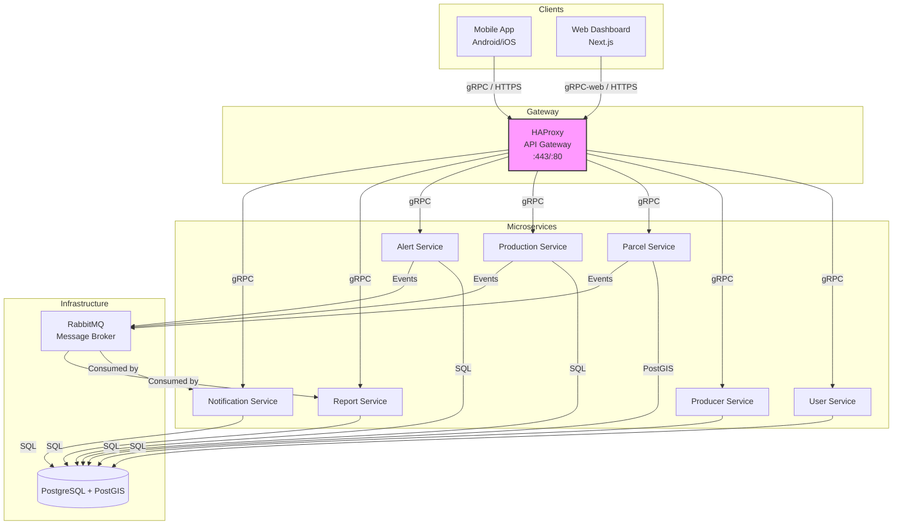
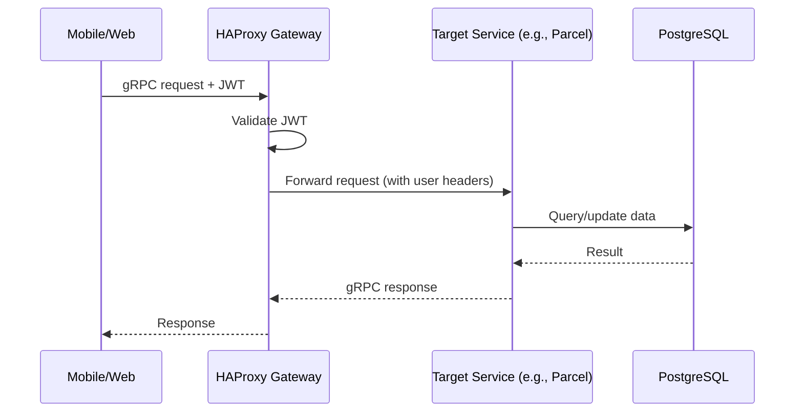
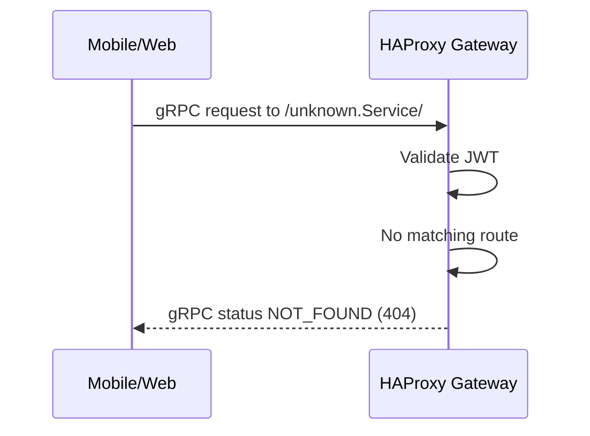
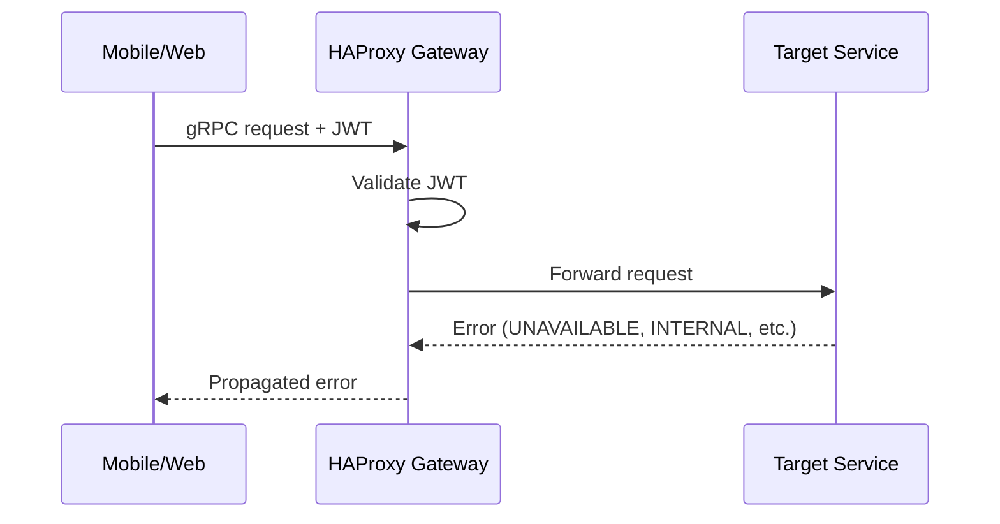

# SIG-Agro Backend

## Project Overview

SIG-Agro (Geographic Agricultural Information System) is a digital solution designed for the Ministry of Agriculture to modernize agricultural management. The system replaces manual, fragmented processes with a centralized platform that enables:

- **Real‑time supervision** of agricultural zones and producers.
- **Georeferencing** of every agricultural parcel nationwide.
- **Monitoring of production** by region and crop type.
- **Early warning system** for pests, droughts, and floods.
- **Automated reporting** for strategic decision‑making.

This repository contains the **backend** of SIG‑Agro, consisting of a set of microservices written in Go, an API gateway based on HAProxy, and supporting infrastructure (PostgreSQL, RabbitMQ). The backend exposes gRPC APIs consumed by a mobile app (Kotlin/Jetpack Compose) and a web dashboard (Next.js).

---

## Architecture Overview

The backend follows a **microservices architecture** to ensure scalability, maintainability, and separation of concerns. Communication between services is:

- **Synchronous**: gRPC (HTTP/2, Protocol Buffers) for request‑response patterns.
- **Asynchronous**: RabbitMQ for event‑driven interactions (e.g., notifying other services of parcel creation or alert generation).

All external requests pass through an **HAProxy** instance that acts as the API Gateway. HAProxy handles:

- TLS termination
- JWT validation (using a public key)
- Routing to the appropriate microservice based on the gRPC method path
- Injecting user identity (X-User-Id, X-User-Roles) into the gRPC metadata

The following diagram illustrates the overall system architecture:



---

## Microservices

Each microservice is responsible for a well‑defined domain and can be developed, deployed, and scaled independently.

| Service | Responsibility | Database (PostgreSQL) |
|---------|----------------|----------------------|
| **User Service** | Authentication, user management, roles, JWT issuance and validation | `users`, `roles`, `refresh_tokens` |
| **Producer Service** | CRUD operations for agricultural producers | `producers` |
| **Parcel Service** | Georeferencing of parcels (PostGIS), CRUD, spatial queries | `parcels` (geometry column) |
| **Production Service** | Recording planting, fertilization, harvest activities; production monitoring | `crops`, `activities` |
| **Alert Service** | Rule evaluation (drought, pests, floods), integration with weather APIs | `alert_rules`, `alerts` |
| **Notification Service** | Sending push (FCM), SMS, email notifications | `device_tokens`, `notifications_log` |
| **Report Service** | Aggregated statistics, dashboard data, report generation (PDF/Excel) | Views/materialized tables |

### Technology Stack

- **Language**: Go 1.22+
- **API**: gRPC with Protocol Buffers (v3)
- **Database**: PostgreSQL 15+ with PostGIS extension
- **Database Access**: SQLC (type‑safe generated code)
- **Message Broker**: RabbitMQ (events)
- **API Gateway**: HAProxy (v2.9+)
- **Containerization**: Docker + Docker Compose (development)
- **Orchestration**: Kubernetes (production, optional)

---

## Communication Patterns

### Synchronous (gRPC)

All microservices expose gRPC services defined in `.proto` files. Clients (mobile, web) communicate with the API Gateway (HAProxy) using gRPC or gRPC‑web. HAProxy routes requests to the appropriate service based on the method path:

- `/user.UserService/` → user‑service:50051
- `/producer.ProducerService/` → producer‑service:50051
- `/parcel.ParcelService/` → parcel‑service:50051
- etc.

Each gRPC call carries a JWT in the `Authorization` header. HAProxy validates the token and forwards the user context via metadata headers (`X-User-Id`, `X-User-Roles`). Services can then use this information for authorization.

### Asynchronous (Events)

Events are published to RabbitMQ exchanges (topic: `agro.events`) for cross‑service communication. This decouples services and improves resilience.

**Examples of events**:

- `parcel.created` – published by Parcel Service after a new parcel is stored.
- `activity.recorded` – published by Production Service.
- `alert.triggered` – published by Alert Service.

**Consumers**:

- Notification Service listens for `alert.triggered` to send alerts.
- Report Service listens for various events to update aggregated views.

---

## Security

- **Authentication**: JWT (RS256) signed by the User Service. The public key is shared with HAProxy and optionally with other services that need to validate tokens.
- **Authorization**: Each service validates roles/permissions based on the `X-User-Roles` header injected by HAProxy.
- **Transport**: All external traffic is over HTTPS (TLS). Internal communication within the Docker network can be plain HTTP/2 (gRPC) as the network is isolated.
- **Sensitive Data**: Passwords are hashed using bcrypt. Refresh tokens are stored as hashes.

---

## Flow Diagrams

### 1. Successful Request (Happy Path)



### 2. Request to Non‑existent Service



### 3. Service Error (e.g., Timeout)



---

## Getting Started (Development)

### Prerequisites

- Docker and Docker Compose
- Go 1.22+ (for local development outside containers)
- `protoc` compiler + plugins (`protoc-gen-go`, `protoc-gen-go-grpc`)
- `sqlc` (optional, code is generated via Docker)

### Clone the Repository

```bash
git clone https://github.com/your-org/sig-agro-backend.git
cd sig-agro-backend
```

### Build and Run with Docker Compose

```bash
docker-compose up --build
```

This will start:

- PostgreSQL with PostGIS (port 5432)
- RabbitMQ (port 5672, management UI on 15672)
- HAProxy (ports 80, 443)
- All microservices (each on port 50051 internally)

### Verify Services

Use `grpcurl` to test a service via HAProxy:

```bash
# Obtain a token (example)
grpcurl -plaintext -d '{"email":"admin@example.com","password":"admin"}' localhost:80 user.UserService/Login

# Then call a protected endpoint
grpcurl -H "Authorization: Bearer <token>" -plaintext localhost:80 parcel.ParcelService/ListParcels
```

### Makefile

A `Makefile` is provided with useful commands:

```bash
make proto          # Regenerate protobuf stubs for all services
make sqlc           # Regenerate SQLC code for all services
make migrate-up     # Run database migrations
make build          # Build all Docker images
make up             # docker-compose up -d
make down           # docker-compose down
make logs           # Follow logs of all containers
```

---

## API Conventions

All services follow these conventions:

- **Protocol**: gRPC over HTTP/2.
- **Methods**: Defined in `.proto` files following the format `service.ServiceName/MethodName`.
- **Errors**: Standard gRPC status codes are used (e.g., `INVALID_ARGUMENT`, `NOT_FOUND`, `UNAUTHENTICATED`).
- **Metadata**: HAProxy injects `x-user-id` and `x-user-roles` as gRPC metadata for authorization.
- **Pagination**: List methods use `limit` and `offset` fields in request messages.

### Example .proto snippet

```protobuf
service ParcelService {
  rpc CreateParcel(CreateParcelRequest) returns (Parcel);
  rpc GetParcel(GetParcelRequest) returns (Parcel);
  rpc ListParcels(ListParcelsRequest) returns (ListParcelsResponse);
}

message Parcel {
  string id = 1;
  string producer_id = 2;
  string name = 3;
  string geometry_wkt = 4; // Well-Known Text
  double area_hectares = 5;
  google.protobuf.Timestamp created_at = 6;
}
```

---

## Event Schema

Events are published to RabbitMQ exchange `agro.events` as JSON messages with the following structure:

```json
{
  "event_type": "parcel.created",
  "timestamp": "2025-03-26T10:00:00Z",
  "data": {
    "parcel_id": "uuid",
    "producer_id": "uuid",
    "geometry_wkt": "POLYGON((...))"
  }
}
```

Consumers use the `event_type` field to route to appropriate handlers.

---

## Deployment (Production)

For production, we recommend deploying on Kubernetes with:

- Each microservice as a separate Deployment + Service.
- HAProxy as an Ingress Controller or standalone Deployment.
- PostgreSQL managed (e.g., RDS, Cloud SQL) or self‑hosted with replication.
- RabbitMQ as a StatefulSet with persistent volumes.

The repository includes Helm charts (to be added) and Kubernetes manifests for reference.

---

## Contributing

Please read [CONTRIBUTING.md](CONTRIBUTING.md) for guidelines on how to add new services, modify protos, or submit bug fixes.

---

## License

This project is proprietary and owned by the Ministry of Agriculture. Contact the development team for licensing details.

---

## Contact

For questions or support, reach out to the development team at [dev@example.com](mailto:dev@example.com).

---

This README provides a comprehensive overview of the SIG‑Agro backend. For more detailed documentation, refer to the `/docs` folder and service‑specific README files.